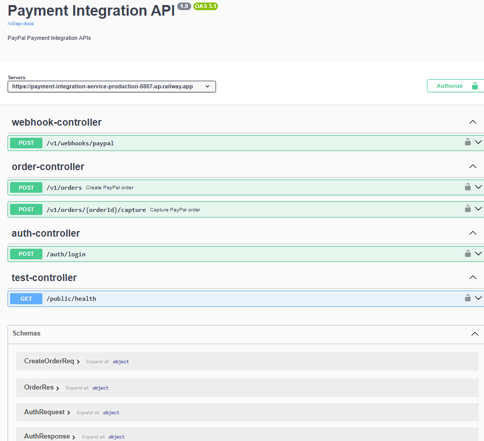
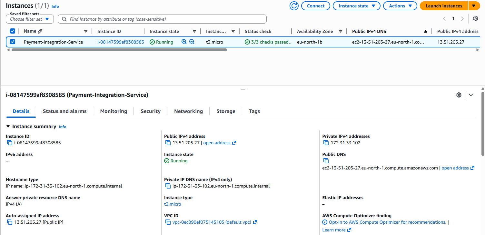
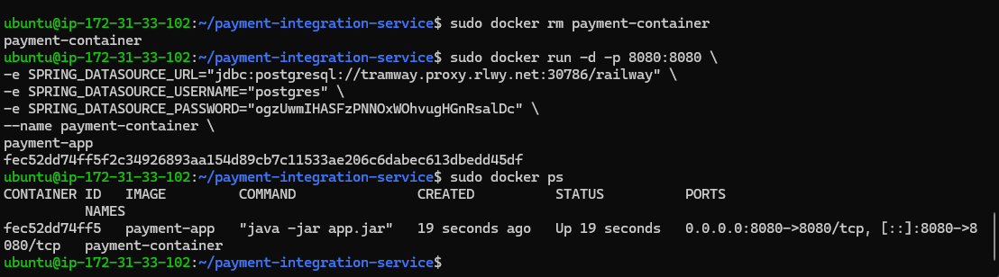

# Payment Integration Service (PayPal API)

A Spring Boot backend application for PayPal payment processing, including OAuth authentication, order creation, payment capture, webhook processing, JWT authentication, Flyway migrations, Docker containerization, and cloud deployment.

---

## Features

- PayPal OAuth token generation
- Create PayPal payment orders
- Capture approved PayPal payments
- Webhook event processing
- JWT-based authentication
- REST API documentation with Swagger/OpenAPI
- PostgreSQL database integration
- Flyway database migrations
- Docker containerization
- Railway cloud deployment
- AWS EC2 deployment
- Unit testing with JUnit and Mockito
- Centralized exception handling
- Reusable HTTP communication engine

---

## Technologies Used

### Backend
- Java 21
- Spring Boot
- Spring Security
- Spring Data JPA
- PostgreSQL
- Flyway
- JWT Authentication
- Swagger / OpenAPI
- Docker
- Maven

### Testing
- JUnit 5
- Mockito

### Cloud & Deployment
- Railway
- AWS EC2
- Docker Compose

---

## Architecture

The application follows a layered monolithic
architecture (N-Tier) with clear separation
of concerns across four layers.

### Layered Structure

Controller Layer  → handles HTTP requests/responses
       ↓
Service Layer     → contains all business logic
       ↓
Repository Layer  → handles all database operations
       ↓
PostgreSQL Database

### Main Packages

- `controller` → REST API endpoints
- `service`    → business logic and PayPal integration
- `repository` → database access layer
- `entity`     → database table mappings
- `dto`        → request and response data transfer objects
- `security`   → JWT authentication and authorization
- `exception`  → centralized exception handling
- `config`     → application configuration beans
- `helper`     → request transformation utilities
- `http`       → reusable HTTP communication engine


---

## Authentication Flow

The application uses JWT-based authentication.

### Login Flow

```text
Client Login Request
        ↓
AuthController
        ↓
AuthService
        ↓
AuthenticationManager
        ↓
JWT Token Generation
        ↓
Return Token
```

Protected endpoints require a valid JWT token.

Public endpoints:
- `/auth/**`
- `/swagger-ui/**`
- `/v3/api-docs/**`
- `/v1/webhooks/**`
- `/public/**`

---

## PayPal Integration Flow

### Create Order

```text
Frontend Request
        ↓
Generate PayPal OAuth Token
        ↓
Build PayPal CreateOrder Request
        ↓
Call PayPal REST API
        ↓
Store Transaction in PostgreSQL
        ↓
Return Approval URL
```

### Capture Payment

```text
Approved PayPal Payment
        ↓
Capture Endpoint
        ↓
PayPal Capture API
        ↓
Update Transaction Status
        ↓
Return Capture Response
```

---

## Webhook Processing

The application processes PayPal webhook events asynchronously.

Supported webhook events:
- `PAYMENT.CAPTURE.COMPLETED`
- `PAYMENT.CAPTURE.DENIED`

Webhook events update transaction status in PostgreSQL.

---

## Database Migrations

Flyway is used for database schema versioning.

Migration examples:
- Create transaction tables
- Insert master data
- Rename PayPal order column
- Remove unused transaction status

---

## REST API Endpoints

| Method | Endpoint | Description |
|---|---|---|
| POST | `/auth/login` | Authenticate user |
| POST | `/v1/orders` | Create PayPal order |
| POST | `/v1/orders/{orderId}/capture` | Capture PayPal order |
| POST | `/v1/webhooks/paypal` | PayPal webhook endpoint |
| GET | `/public/health` | Health check |


---

## Swagger API Documentation

Live Swagger Documentation:

https://payment-integration-service-production-6867.up.railway.app/swagger-ui/index.html

---

## Application Preview

### Swagger/OpenAPI Documentation



### AWS EC2 Deployment



### Docker Container Running


---

## Docker Deployment

The application uses a multi-stage Docker build.

### Build Docker Image

```bash
docker build -t payment-app .
```

### Run Docker Container

```bash
docker run -p 8080:8080 payment-app
```

---

## Environment Variables

```env
SPRING_DATASOURCE_URL=
SPRING_DATASOURCE_USERNAME=
SPRING_DATASOURCE_PASSWORD=

PAYPAL_CLIENT_ID=
PAYPAL_CLIENT_SECRET=

PAYPAL_OAUTH_URL=
PAYPAL_CREATE_ORDER_URL=
PAYPAL_CAPTURE_ORDER_URL=

APP_ADMIN_USERNAME=
APP_ADMIN_PASSWORD=
APP_USER_USERNAME=
APP_USER_PASSWORD=
JWT_SECRET=
```

---

## Testing

Unit tests were implemented using:
- JUnit 5
- Mockito

Test coverage includes:
- JWT service testing
- Authentication service testing
- Order service testing

---

## Future Improvements

- Integrate the payment service with the SecureStaff employee management system
- Implement employee salary payment processing
- Add bonus and reimbursement payment features
- Support multiple payment providers such as Stripe and Paystack
- Add refresh token support
- Implement role-based authorization
- Add payment refund functionality
- Introduce CI/CD pipeline automation
- Explore Kubernetes deployment

---

## Author

Ogechi Sylvia Uzoma
